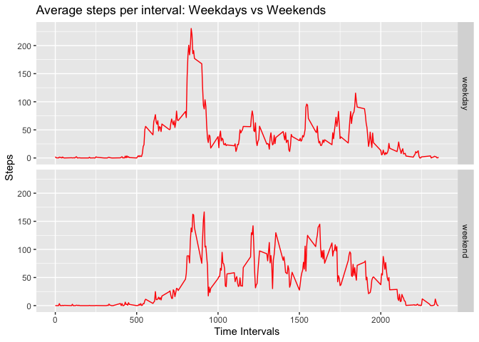

## Loading and preprocessing the data
### Exploring the dataset
Unzipping of file, reading and exploring data.

```r
unzip("activity.zip")
act<-read.csv("activity.csv")
summary(act)
```

```
##      steps            date              interval     
##  Min.   :  0.00   Length:17568       Min.   :   0.0  
##  1st Qu.:  0.00   Class :character   1st Qu.: 588.8  
##  Median :  0.00   Mode  :character   Median :1177.5  
##  Mean   : 37.38                      Mean   :1177.5  
##  3rd Qu.: 12.00                      3rd Qu.:1766.2  
##  Max.   :806.00                      Max.   :2355.0  
##  NA's   :2304
```

```r
names(act)
```

```
## [1] "steps"    "date"     "interval"
```

```r
head(act)
```

```
##   steps       date interval
## 1    NA 2012-10-01        0
## 2    NA 2012-10-01        5
## 3    NA 2012-10-01       10
## 4    NA 2012-10-01       15
## 5    NA 2012-10-01       20
## 6    NA 2012-10-01       25
```
### Converting act$date to Date format and generating pairs.

```r
act$date<- as.Date(act$date)
summary(act)
```

```
##      steps             date               interval     
##  Min.   :  0.00   Min.   :2012-10-01   Min.   :   0.0  
##  1st Qu.:  0.00   1st Qu.:2012-10-16   1st Qu.: 588.8  
##  Median :  0.00   Median :2012-10-31   Median :1177.5  
##  Mean   : 37.38   Mean   :2012-10-31   Mean   :1177.5  
##  3rd Qu.: 12.00   3rd Qu.:2012-11-15   3rd Qu.:1766.2  
##  Max.   :806.00   Max.   :2012-11-30   Max.   :2355.0  
##  NA's   :2304
```

```r
pairs(act)
```

<!-- -->

## What is mean total number of steps taken per day?
### Summarising data to sum the steps in each day and storing in stepsday.

```r
library(dplyr)
library(magrittr)
stepsday<- act %>% group_by(date) %>% summarise_each(funs(sum)) 
names(stepsday)<- c("date", "total.steps", "intervals")
str(stepsday)
```

```
## tibble [61 × 3] (S3: tbl_df/tbl/data.frame)
##  $ date       : Date[1:61], format: "2012-10-01" "2012-10-02" ...
##  $ total.steps: int [1:61] NA 126 11352 12116 13294 15420 11015 NA 12811 9900 ...
##  $ intervals  : int [1:61] 339120 339120 339120 339120 339120 339120 339120 339120 339120 339120 ...
```
### Plotting Chart

```r
library(ggplot2)
g<- ggplot(stepsday, aes( y=total.steps, x=date)) + 
    geom_bar(stat = "identity") + 
    ylab("Total Steps") +
    xlab("Date") +
    ggtitle("Total Steps by Date")+
    theme_bw()
  
g
```

<!-- -->

### Mean and Median

```r
summary(stepsday)
```

```
##       date             total.steps      intervals     
##  Min.   :2012-10-01   Min.   :   41   Min.   :339120  
##  1st Qu.:2012-10-16   1st Qu.: 8841   1st Qu.:339120  
##  Median :2012-10-31   Median :10765   Median :339120  
##  Mean   :2012-10-31   Mean   :10766   Mean   :339120  
##  3rd Qu.:2012-11-15   3rd Qu.:13294   3rd Qu.:339120  
##  Max.   :2012-11-30   Max.   :21194   Max.   :339120  
##                       NA's   :8
```
## What is the average daily activity pattern?
### Plotting time series for average daily pattern and searching for maximum steps

```r
library(dplyr)
library(magrittr)
library(ggplot2)
stepsint<- act %>% 
    select(steps, interval)%>% 
    group_by(interval) %>% 
    summarise_each(funs(mean(., na.rm=T)))
    str(stepsint)
```

```
## tibble [288 × 2] (S3: tbl_df/tbl/data.frame)
##  $ interval: int [1:288] 0 5 10 15 20 25 30 35 40 45 ...
##  $ steps   : num [1:288] 1.717 0.3396 0.1321 0.1509 0.0755 ...
```

```r
g<-ggplot(stepsint, aes(interval, steps)) + 
    geom_line(col="red") + 
    ggtitle("Average number of steps per time interval across all days") +
    xlab("Time") + ylab("Steps")
g
```

<!-- -->

```r
stepsint %>% 
    select(steps, interval) %>%
    filter(steps==max(stepsint$steps))
```

```
## # A tibble: 1 x 2
##   steps interval
##   <dbl>    <int>
## 1  206.      835
```

## Imputing missing values

```r
print(c("Total counts of missing data: ", sum(is.na(act$steps))))
```

```
## [1] "Total counts of missing data: " "2304"
```

Missing values were replaced by matching the mean steps obtained at each intervals across all days. The data is then imputed into the individual intervals with missing data. Summary is printed to show that no NA values are found in steps varible. 


```r
act$nonasteps<- ifelse(is.na(act$steps), round(stepsint$steps[match(act$interval,stepsint$interval)],0),act$steps)
newact<- select(act, interval, date, nonasteps)
summary(newact)
```

```
##     interval           date              nonasteps     
##  Min.   :   0.0   Min.   :2012-10-01   Min.   :  0.00  
##  1st Qu.: 588.8   1st Qu.:2012-10-16   1st Qu.:  0.00  
##  Median :1177.5   Median :2012-10-31   Median :  0.00  
##  Mean   :1177.5   Mean   :2012-10-31   Mean   : 37.38  
##  3rd Qu.:1766.2   3rd Qu.:2012-11-15   3rd Qu.: 27.00  
##  Max.   :2355.0   Max.   :2012-11-30   Max.   :806.00
```
### Histogram for Imputed Steps Data

```r
library(ggplot2)
g<- ggplot(newact, aes( y=nonasteps, x=date)) + 
    geom_bar(stat = "identity") + 
    ylab("Total Steps") +
    xlab("Date") +
    ggtitle("Total Steps by Date")+
    theme_bw()
  
g
```

<!-- -->

### Make a histogram of the total number of steps taken each day and Calculate and report the mean and median total number of steps taken per day. Do these values differ from the estimates from the first part of the assignment? What is the impact of imputing missing data on the estimates of the total daily number of steps?

The difference as observed below with no changed in mean and median had dropped by median of 3 steps. As mean data was used, it doesn't not have great impact on the mean data. However, it does skew the median by a few steps. 


```r
library(dplyr)
library(magrittr)
newactday<- newact %>% group_by(date) %>% summarise_each(funs(sum)) 
names(newactday)<- c("date", "intervals", "total.steps")
str(newactday)
```

```
## tibble [61 × 3] (S3: tbl_df/tbl/data.frame)
##  $ date       : Date[1:61], format: "2012-10-01" "2012-10-02" ...
##  $ intervals  : int [1:61] 339120 339120 339120 339120 339120 339120 339120 339120 339120 339120 ...
##  $ total.steps: num [1:61] 10762 126 11352 12116 13294 ...
```

```r
summary(newactday)
```

```
##       date              intervals       total.steps   
##  Min.   :2012-10-01   Min.   :339120   Min.   :   41  
##  1st Qu.:2012-10-16   1st Qu.:339120   1st Qu.: 9819  
##  Median :2012-10-31   Median :339120   Median :10762  
##  Mean   :2012-10-31   Mean   :339120   Mean   :10766  
##  3rd Qu.:2012-11-15   3rd Qu.:339120   3rd Qu.:12811  
##  Max.   :2012-11-30   Max.   :339120   Max.   :21194
```

```r
summary(stepsday)
```

```
##       date             total.steps      intervals     
##  Min.   :2012-10-01   Min.   :   41   Min.   :339120  
##  1st Qu.:2012-10-16   1st Qu.: 8841   1st Qu.:339120  
##  Median :2012-10-31   Median :10765   Median :339120  
##  Mean   :2012-10-31   Mean   :10766   Mean   :339120  
##  3rd Qu.:2012-11-15   3rd Qu.:13294   3rd Qu.:339120  
##  Max.   :2012-11-30   Max.   :21194   Max.   :339120  
##                       NA's   :8
```


## Are there differences in activity patterns between weekdays and weekends?

As observed in the line chart below, there were more steps on weekdays. 


```r
library(dplyr)
library(magrittr)
library(ggplot2)

newact$date<- as.Date(newact$date)
newact$day<- ifelse(weekdays(newact$date) %in% c("Monday","Tuesday","Wednesday","Thursday","Friday") == T, "weekday", "weekend")


newact$day<- as.factor(newact$day)
grouped<- newact %>% select(day,nonasteps,interval) %>% group_by(day, interval) %>% summarise_each(funs (sum))
str(newactday)
```

```
## tibble [61 × 3] (S3: tbl_df/tbl/data.frame)
##  $ date       : Date[1:61], format: "2012-10-01" "2012-10-02" ...
##  $ intervals  : int [1:61] 339120 339120 339120 339120 339120 339120 339120 339120 339120 339120 ...
##  $ total.steps: num [1:61] 10762 126 11352 12116 13294 ...
```

```r
g<- ggplot(grouped, aes(interval,nonasteps)) +
  geom_line(col = "red") +
  ggtitle("Average steps per interval: Weekdays vs Weekends") +
  xlab("Steps") + ylab("Time Intervals") + facet_grid(day ~ .)

g
```

<!-- -->

